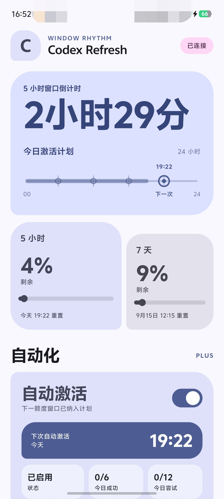

#  Codex Refresh

[](https://github.com/wmdhs12138/codex-refresh/actions/workflows/ci.yml)

原生 Android（Kotlin + Jetpack Compose）客户端：监控 ChatGPT 订阅的 Codex 用量额度，并在 5 小时窗口可用时**自动激活**，让额度窗口按你的作息节奏运转。

> [!IMPORTANT]
> 本项目与 OpenAI、ChatGPT、Codex 官方无隶属关系，不会绕过、扩充或破解任何额度。它只使用你已登录的订阅，在计划时间发送一个普通的最小请求，让下一个 5 小时窗口开始计时。Codex 用量接口属于 ChatGPT 后端接口而非稳定公开 API，字段与可用性可能变化，请自行评估使用风险。



## 功能

- **5 小时窗口状态**：结合用量与 `reset_at` 是否固定判断活动窗口；0% 模糊状态只做一次前台确认，待命时显示“等待激活”
- **5 小时 / 7 天剩余额度**：服务端“已使用百分比”换算为剩余百分比，数字与进度条都表示剩余容量
- **自动激活**：到点由 WorkManager 发送一个轻量挑战请求启动新窗口；窗口活跃、额度耗尽或结果未知时安全跳过，不会重复发送
- **静默准时唤醒**：Android 12+ 可由用户授予“闹钟和提醒”权限，在夜间 Doze 中按计划唤醒任务；不响铃、不振动、不亮屏，未授权时自动退化为省电兼容调度
- **按上班时间优化激活点**：默认 08:30–17:30，推荐点为 05:30 / 10:30 / 15:30，让上班时段接触三个额度窗口；支持跨午夜班次
- **24 小时 Day Rail**：今天已过去的部分更粗更实；只显示已确认的当前窗口结束点、自动计划点、下一次激活与真实成功，不从旧 reset 推造窗口
- **常驻通知**：活动窗口显示 `5小时：17:30重置｜7天：9月15日·12:00重置`，到期后自动改为 `5小时：等待激活`；不会为通知额外发起网络请求
- **手动备用卡片**：重新读取额度、手动发送激活请求、设备码重新登录等异常恢复操作
- **本地额度诊断**：记录既有额度读取的来源、原始 `used_percent`、`reset_at` 与相关窗口秒数，便于核对服务端行为；不记录账号、Token 或 Prompt
- **设备码 OAuth 登录**：无需密码；Token 由 Android Keystore 加密存储，不写日志

## 安装

从 [Releases](https://github.com/wmdhs12138/codex-refresh/releases) 下载 APK 侧载安装（最低 Android 8.0），也可以自行构建。

> v0.3.5 是首个使用长期固定 release key 签名的版本。若设备上安装的是 v0.3.4 或更早的 debug 签名包，需要先卸载旧包再安装一次；此后的正式版本可以直接覆盖升级。卸载会清除本机登录状态。

首次使用：

1. 打开应用，按提示完成设备码登录；
2. 首页查看 5 小时与 7 天额度；
3. 需要自动激活时打开“自动激活”开关，并允许通知。

自动激活依赖前台常驻服务与 WorkManager 后台任务。为保证长期运行，建议：

- 允许通知（Android 13+ 需手动授予）
- 允许“闹钟和提醒”（Android 12+，用于夜间静默准时唤醒；不会产生闹钟声）
- 允许应用后台运行 / 自启动（视厂商系统而定）
- 在电池设置中取消对该应用的电池优化

## 自动化安全语义

自动功能默认关闭，只有用户在“自动激活”卡片明确打开后才启用。启用后：

- 启用不会立即发送请求；首次 worker 只读取额度元数据
- 优先安排可信的 5 小时 reset + 10 秒；0% 模糊窗口在 12 秒后只确认一次元数据，其他信息不完整时 5 分钟后重试
- 到期后每次最多发送一个短挑战；发送前刷新临近过期的令牌并重读用量接口
- 自动任务的既有额度预检会同步本地 reset 与常驻通知，不为此额外轮询
- 活跃 5 小时窗口、已耗尽额度、额度缺失都会 fail closed，不发送请求
- 请求开始前以同步事务持久化尝试计数与“5 小时 + 10 秒”租约；进程崩溃或重启也不会重复发送
- 超时或异常按“请求可能已成功”处理，保留整段租约保守等待
- 只有精确的 challenge 匹配才算成功；每日上限：成功 6 次、尝试 12 次，按本地日历日重置
- 手动请求与自动任务互斥协调：手动成功会以更早的可信目标更新下一次计划

服务端在待命时返回随读取时间平移的五小时 `reset_at`，活动窗口的 `reset_at` 则保持固定。界面与自动任务共用这一证据模型，不再把单个未来时间戳当作活动窗口。

## 构建

要求：

- JDK 21
- Android SDK（compileSdk 36）
- Gradle 9.5.1（使用仓库内 wrapper）

```sh
./gradlew --no-daemon testDebugUnitTest lintDebug assembleDebug
```

APK 产物：`app/build/outputs/apk/debug/app-debug.apk`。

正式发布包使用环境变量注入签名材料，配置与证书指纹见 [发布签名说明](docs/RELEASE_SIGNING.md)。

### 在 Termux / ARM 设备上构建

Maven 分发的 aapt2 仅提供 x86_64 版本，ARM 设备需要在用户级 `~/.gradle/gradle.properties` 指向本机可执行的 aapt2（Android SDK build-tools 已提供 aarch64 版本）：

```properties
android.aapt2FromMavenOverride=/opt/android-sdk/build-tools/36.1.0/aapt2
```

例如在 proot Ubuntu 容器中安装 Android SDK 后，即可正常执行上述 Gradle 命令。GitHub Actions 等 x86_64 环境无需该配置。

## 项目结构

```text
app/src/main/java/com/codexrefresh/app/
├── MainActivity.kt          # Activity 与页面状态协调
├── ExpressiveHome.kt        # Material 3 Expressive 主界面（Compose）
├── CodexClient.kt           # 设备码 OAuth、WHAM 额度、Responses SSE 挑战、Keystore TokenStore
├── AutoScheduler.kt         # 调度策略：目标计算、租约、安全门与每日上限
├── AutoWorker.kt            # WorkManager 唯一网络执行者
├── AutoAlarm.kt             # Doze 下的静默唤醒与精确/近似调度降级
├── AutoKeepAliveService.kt  # 用户 opt-in 的前台常驻 supervisor
├── AutoBootReceiver.kt      # 开机 / 应用更新后恢复调度
├── WorkSchedule.kt          # 按上班时间优化激活点
├── TimelinePresentation.kt  # 24 小时 Day Rail 呈现模型
├── QuotaPresentation.kt     # 额度呈现（已用百分比 → 剩余容量）
├── ProbeSseState.kt         # 挑战请求的状态校验
└── SseParser.kt             # SSE 增量解析
```

9 个 JVM 测试类覆盖唤醒模式、调度策略、租约与并发协调、额度换算、SSE 解析、时间轴呈现与工作时段推荐，随 `testDebugUnitTest` 运行。

## 已知限制

- 这是个人自用的侧载应用；前台服务使用 Android `specialUse` 类型，若要公开上架，必须重新评估 Google Play 及各分发渠道对后台常驻与前台服务用途的政策要求
- 依赖 ChatGPT 后端接口（WHAM 用量 / Codex Responses），并非稳定公开 API，不能保证兼容性
- 无法绕过系统 force-stop 或厂商后台限制；未授予“闹钟和提醒”权限时会退化为近似唤醒，Doze、电量与网络条件仍可能造成执行延迟
- OpenAI 未提供窗口 reset event / window ID，本地窗口代次与部分重置判断为程序推断

## 姊妹项目

[codex-refresh-pi](https://github.com/wmdhs12138/codex-refresh-pi)：在 Termux 中通过 Pi Coding Agent 实现同类窗口调度的 Python 版本。

## 致谢

- [Pi Coding Agent](https://github.com/earendil-works/pi)（MIT，Mario Zechner）：`CodexClient.kt` 的设备码 OAuth 流程与 Codex 用量 / Responses 请求处理参考并移植自其实现，详见 [THIRD_PARTY_NOTICES.md](THIRD_PARTY_NOTICES.md)。

## 免责声明

本项目与 OpenAI、ChatGPT、Codex 官方无隶属关系。使用者应自行遵守相应服务条款，并承担运行自动化请求的风险。

## 许可证

本项目以 [MIT 许可证](LICENSE)发布。`CodexClient.kt` 中部分实现移植自 [Pi Coding Agent](https://github.com/earendil-works/pi)（MIT），其版权声明与完整许可文本见 [THIRD_PARTY_NOTICES.md](THIRD_PARTY_NOTICES.md)。
